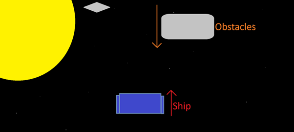
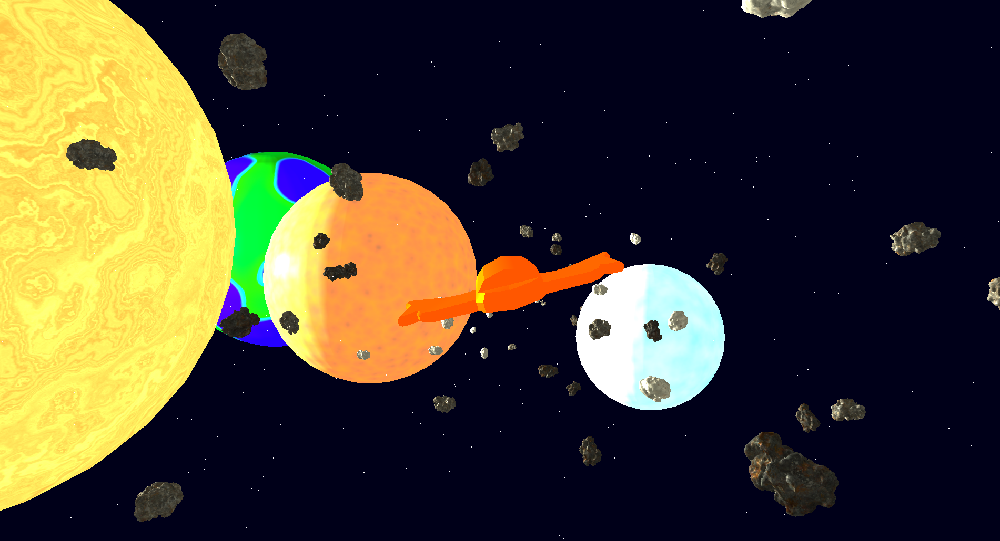
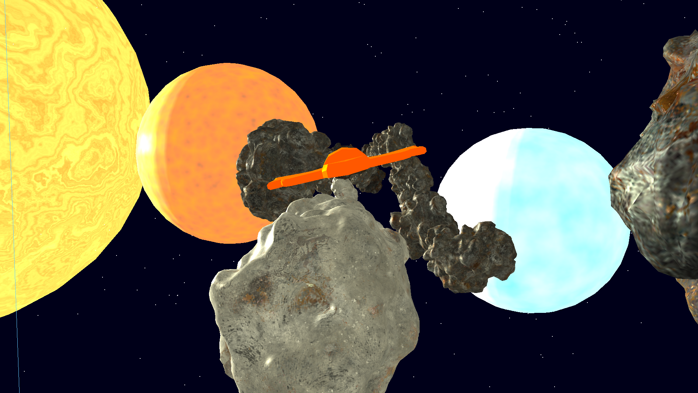
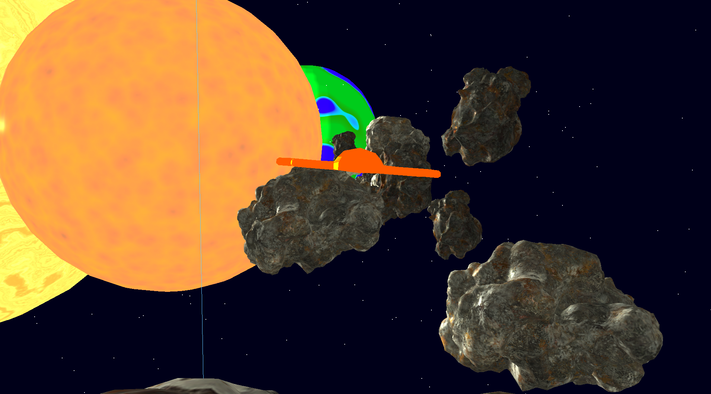

Space Runner OpenGL Game
==========================

Video
====================
Video Link: https://youtu.be/Jkw1_haSXmQ

====================
A C++ and OpenGL 4.X real-time 3D space runner prototype with interactive gameplay, player movement, collisions, dynamically spawning asteroids, animated planets, camera movement, particle-style starfield and shader-based rendering.

This report provides an overview of the system, technical implementation, and development considerations.

Gameplay Description
====================

You control a spaceship travelling through space while avoiding oncoming asteroids.

The objective is survival — the longer the player survives, the higher the score.

Core Features:

*   Real-time spaceship control using **WASD**.
    
*   Camera dynamically tracks the player with subtle tilt based on mouse movement.
    
*   Procedurally animated **starfield background**.
    
*   Continuous spawning **asteroids** that move towards the player with rotation and speed scaling over time.
    
*   Massive background **planet models** slowly rotating in space to add depth.
    
*   Score increases based on time survived + asteroid speed multiplier.
    
*   Game ends when collision is detected.
    

Additional Visual & Interaction Features:

*   Custom shader rendering pipeline.
    
*   Dynamic lighting reacting over time.
    
*   Visible world boundary box.
    
*   Signature within the lower right of the game
    

Dependencies Used
=================

This project was built using only approved libraries for the module.

### 🔧 Core Requirements

*   **C++**
    
*   **OpenGL**
    
*   **GLFW** – Window creation and input handling
    
*   **GLAD** – OpenGL Function Loader
    
*   **ASSIMP** – Model importing
    
*   **GLM** – Math (matrices, vectors, transformations)
    
*   **FastNoiseLite** – Procedural star noise generation
    

### Rendering Assets

*   Blender-made ship and planets by me
    
*   Asteroid models and textures by [https://www.turbosquid.com/Search/Artists/Gerhald3D](https://www.turbosquid.com/Search/Artists/Gerhald3D)
    
*   Custom shaders:
    
    *   vertexShader.vert
        
    *   fragmentShader.frag
        

All dependencies are referenced and required DLLs included in the submission executable.

Use of AI During Development
============================

AI was used as a **supporting resource**, not as a replacement for design or programming thinking.

It helped with:

*   Debugging shader and OpenGL state issues.
    
*   GLFW / GLAD setup assistance.
    
*   Player collision and lighting help
    
*   Refactoring class structures
    
*   Troubleshooting crashes and optimisation
    

Game Programming Patterns Used
==============================

### Object-Oriented Programming

Key classes used:

*   Player
    
*   Obstacle
    
*   Planet
    
*   Stars
    

Each handles its own transformations, drawing, updates, and behaviours.

### Modular Game Loop

*   Input handles player movement and window events.
    
*   Update manages world behaviour (spawning, movement, timing, scoring).
    
*   Render draws models, stars, planets, HUD-like score output.
    

### Procedural Content Pattern

Stars and asteroid spawn positions are **procedurally generated** with randomness and noise to avoid repetition.

Game Mechanics & Implementation
===============================

### Player Movement

Controlled with WASD.

Movement updates position vectors and clamps within world boundaries.

### Dynamic Camera

*   Tracks player smoothly
    
*   Adds subtle **tilt effect** based on mouse movement
    
*   Uses glm::lookAt() with smoothing to avoid jitter
    

### Asteroid System

*   Random spawn positions
    
*   Independent rotation axis + speed per asteroid
    
*   Movement toward player
    
*   Respawns when past camera for continuous flow
    
*   Speed increases with time (difficulty curve)
    

### Planet Animation

Background planets:

*   Independent orbit parameters
    
*   Gentle rotation
    
*   Adds depth and parallax to scene
    

### Starfield

Procedural using **FastNoiseLite**

*   Front + background stars
    
*   Creates illusion of forward movement
    
*   Updates with camera position
    

### Collision Detection

Axis-Aligned Bounding Box:

*   Player bounding box
    
*   Obstacle bounding box
    
*   Shrunk slightly to avoid unfair collisions
    
*   If player hits asteroid, the game ends
    

UML Design Diagram
==================

Sample Screens
==============

### Sample Screen 1 – Many Asteroids

### Sample Screen 2 – Main gameplay

### Sample Screen 3 – Late Game / High Difficulty

Exception Handling & Testing
============================

### Error handling

*   Checks for GLFW window creation failure.
    
*   Checks GLAD initialization.
    
*   Safe handling of assets not loading.
    

### Runtime Testing

Manually tested:

*   High asteroid spawn density
    
*   Performance stability
    
*   Collision edge cases
    
*   Window resize
    
*   Long-duration survival play
    

### Optimisation

*   Game runs consistently without crashes.
    
*   Maintains real-time frame update even with multiple objects.
    

Further Technical Details
=========================

### Rendering

*   Depth buffering enabled
    
*   Back-face culling enabled
    
*   Shader uniforms for:
    
    *   Lighting
        
    *   View / Projection
        
    *   Model transforms
        
*   VAO/VBO
    
*   Line rendering for boundary
    

### Timing

Uses GLFW time to:

*   Track delta time
    
*   Drive animations
    
*   Control asteroid difficulty scaling
    
*   Calculate score
    

Evaluation & Reflection
=======================

### What Was Achieved

*   Fully working OpenGL real-time game
    
*   Procedural animation and movement
    
*   Interactive camera and movement system
    
*   Collision detection system
    
*   Multiple dynamically moving objects
    
*   Animated lighting elements
    

### What Could Be Improved

*   UI text overlay (score and timer)
    
*   Sound implementation
    
*   More gameplay mechanics